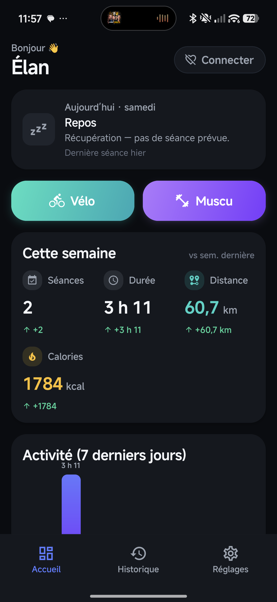
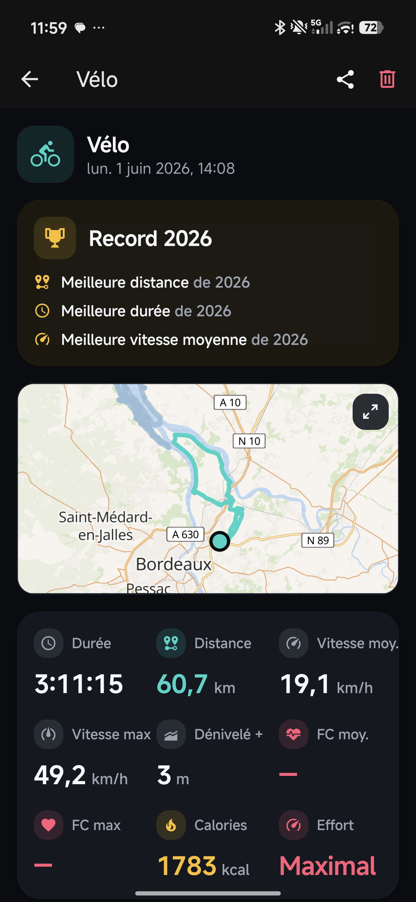
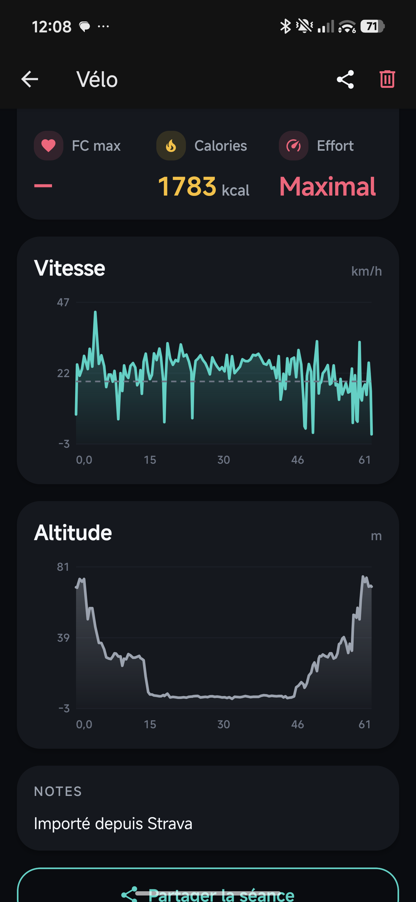
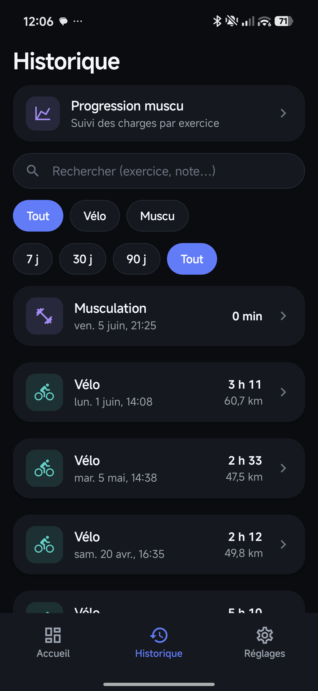
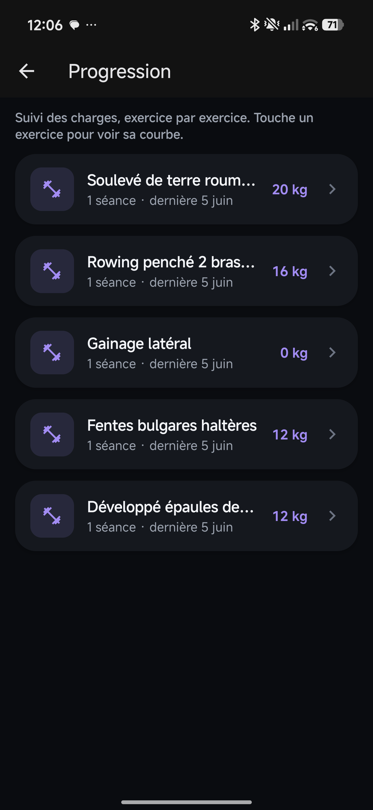
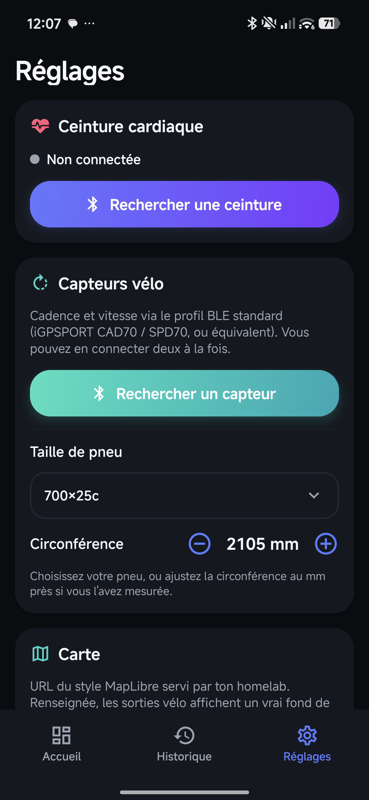
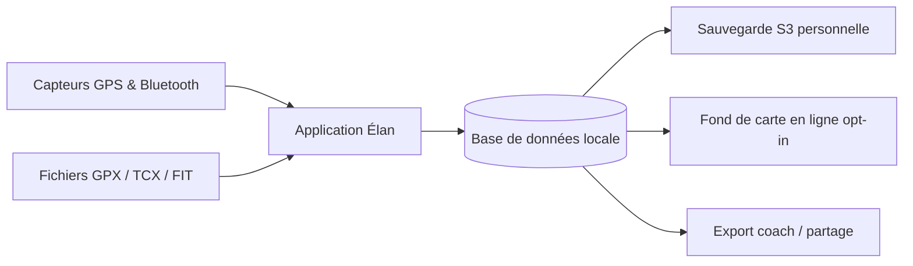
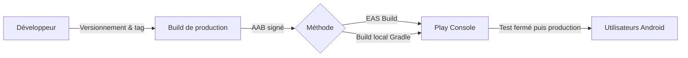

# Élan 🚴‍♂️🏋️

Élan est une application mobile de **suivi sportif personnel**, pensée pour le **vélo** et la **musculation**. Elle fonctionne **100 % hors-ligne** : aucune donnée ne quitte votre téléphone, sans compte ni serveur.

> 🔒 **Vos données restent sur votre appareil.** Tout est stocké dans une base locale. Les seules connexions réseau sont **optionnelles** et configurées par vous-même (sauvegarde et fonds de carte sur vos propres serveurs).

---

## Table des matières

- [À quoi sert ce produit ?](#à-quoi-sert-ce-produit-)
- [Captures d'écran](#captures-décran)
- [Fonctionnalités principales](#fonctionnalités-principales)
- [Comment ça fonctionne](#comment-ça-fonctionne)
- [Environnements](#environnements)
- [Déploiement](#déploiement)
- [Stack technique](#stack-technique)
- [Documentation complémentaire](#documentation-complémentaire)

### Documentation technique

| Document | Description |
|----------|-------------|
| [Capteurs Bluetooth](docs/CAPTEURS.md) | Appairer une ceinture cardiaque ou un capteur vélo, reconnexion auto, dépannage |
| [Importer vos sorties](docs/IMPORT.md) | Reprendre d'anciennes activités depuis des fichiers GPX, TCX ou FIT |
| [Sauvegarde des données](docs/SAUVEGARDE.md) | Configurer la sauvegarde optionnelle vers votre propre serveur S3 |
| [Export « coach » pour une IA](docs/EXPORT-COACH.md) | Générer un bilan d'entraînement Markdown ou JSON à analyser par une IA |
| [Guide de publication Play Store](docs/PUBLISHING.md) | Procédure pas à pas pour publier l'application sur le Google Play Store |
| [Sécurité des données](docs/DATA_SAFETY.md) | Réponses prêtes à l'emploi pour le questionnaire « Sécurité des données » de la Play Console |
| [Politique de confidentialité](PRIVACY.md) | Engagement de confidentialité de l'application (texte public) |
| [Système de design PULSE](DESIGN.md) | Règles visuelles : couleurs, typographie, composants |

---

## À quoi sert ce produit ?

- **Mesurer vos sorties vélo** en temps réel : distance, vitesse, dénivelé et tracé du parcours.
- **Suivre vos séances de musculation** : exercices, séries, charges soulevées et progression.
- **Enregistrer votre fréquence cardiaque** via une ceinture Bluetooth pour estimer l'effort et les calories.
- **Garder l'historique** de toutes vos activités et visualiser vos progrès dans le temps.
- **Rester maître de vos données** : tout est local, sauvegardes et cartes restent sous votre contrôle.

---

## Captures d'écran

<table>
  <tr>
    <td align="center" width="33%">
       
      <b>Tableau de bord</b> Résumé de la semaine & activité sur 7 jours
    </td>
    <td align="center" width="33%">
       
      <b>Sortie vélo</b> Carte du parcours, records & statistiques
    </td>
    <td align="center" width="33%">
       
      <b>Vitesse & altitude</b> Courbes détaillées de la séance
    </td>
  </tr>
  <tr>
    <td align="center" width="33%">
       
      <b>Historique</b> Toutes les séances, filtrables par type
    </td>
    <td align="center" width="33%">
       
      <b>Progression muscu</b> Suivi des charges, exercice par exercice
    </td>
    <td align="center" width="33%">
       
      <b>Capteurs</b> Ceinture cardiaque & capteurs vélo Bluetooth
    </td>
  </tr>
</table>

---

## Fonctionnalités principales

- **Séance vélo en direct** — Chronomètre, distance, vitesse instantanée et maximale, dénivelé positif, tracé GPS et calories estimées.
- **Séance musculation en direct** — Exercices, séries (répétitions × charge), volume total soulevé et durée.
- **Ceinture cardiaque Bluetooth** — Connexion automatique à votre capteur cardiaque et reconnexion au lancement.
- **Capteur de cadence/vitesse vélo** — Prise en charge des capteurs Bluetooth de vélo (cadence et vitesse roue).
- **Programmes de musculation** — Modèles de séances prêts à l'emploi (full-body, dos, cervicales) pour démarrer rapidement.
- **Planning hebdomadaire** — Organisation de vos séances sur la semaine, avec rappels optionnels le jour prévu.
- **Tableau de bord** — Résumé de la semaine et graphe d'activité sur 7 jours.
- **Historique & détail** — Toutes les séances filtrables par type, avec page de détail (tracé, courbes, exercices).
- **Progression** — Suivi des charges et des performances, exercice par exercice.
- **Import de fichiers** — Reprise de vos anciennes sorties depuis des fichiers GPX, TCX ou FIT (Strava, autres apps).
- **Partage d'image** — Génération d'une carte visuelle de séance à partager.
- **Sauvegarde sur votre serveur** — Export chiffré en transit vers votre propre stockage compatible S3 (optionnel).
- **Export « coach »** — Bilan d'entraînement lisible par une IA, à déposer dans votre propre outil de suivi.

---

## Comment ça fonctionne

L'application collecte les données pendant la séance grâce au GPS et aux capteurs Bluetooth. Tout est enregistré dans une **base locale** sur le téléphone. Vous pouvez aussi **importer** d'anciennes activités depuis des fichiers. Les connexions externes (sauvegarde, cartes) sont **optionnelles** et pointent vers **vos propres serveurs**.

---

## Environnements

L'application est **locale** : elle ne dépend d'aucun serveur de l'éditeur. Les services réseau ci-dessous sont configurés par l'utilisateur et désactivés par défaut.

| Service | Configuration | Description |
|---------|---------------|-------------|
| Base de données | Automatique | Stockage local sur l'appareil (aucune action requise) |
| Sauvegarde S3 | Saisie par l'utilisateur | Serveur compatible S3 (par exemple MinIO ou SeaweedFS auto-hébergé) |
| Fonds de carte | Opt-in (désactivé par défaut) | OpenFreeMap (gratuit, open source) ou serveur de tuiles MapLibre auto-hébergé |

> En l'absence de configuration, l'application reste pleinement fonctionnelle et la carte bascule sur un tracé vectoriel sans réseau.

---

## Déploiement

La diffusion passe par le **Google Play Store**. Une version de production (App Bundle `.aab`) est produite soit dans le cloud via **EAS Build**, soit **localement** avec Gradle. L'application signée est ensuite envoyée à la **Play Console**, validée en test fermé, puis publiée. Le détail complet figure dans le [guide de publication](docs/PUBLISHING.md).

---

## Stack technique

- **Application :** Expo SDK 56, React Native 0.85, React 19, TypeScript
- **Navigation :** Expo Router (routes typées)
- **Stockage :** `expo-sqlite` (base locale, migrations versionnées)
- **Capteurs :** `expo-location` (GPS), `react-native-ble-plx` (Bluetooth cardio & cadence)
- **Cartes :** MapLibre — fond en ligne opt-in (OpenFreeMap ou serveur auto-hébergé) avec repli vectoriel `react-native-svg` hors-ligne
- **Cible :** Android (iOS configuré mais secondaire)

---

## Documentation complémentaire

- [Capteurs Bluetooth](docs/CAPTEURS.md) — Appairage ceinture cardiaque & capteur vélo.
- [Importer vos sorties](docs/IMPORT.md) — Import de fichiers GPX, TCX et FIT.
- [Sauvegarde des données](docs/SAUVEGARDE.md) — Sauvegarde S3 optionnelle.
- [Export « coach » pour une IA](docs/EXPORT-COACH.md) — Bilan d'entraînement pour une IA.
- [Guide de publication Play Store](docs/PUBLISHING.md) — Mise en ligne sur le Google Play Store.
- [Sécurité des données](docs/DATA_SAFETY.md) — Questionnaire Play Console.
- [Politique de confidentialité](PRIVACY.md) — Texte public de confidentialité.
- [Système de design PULSE](DESIGN.md) — Règles visuelles de l'application.
- [Journal des modifications](CHANGELOG.md) — Historique des versions.

> **Note pour les développeurs :** le Bluetooth nécessite un *development build* (`npx expo run:android`), il ne fonctionne pas dans Expo Go. Les instructions techniques détaillées sont dans `CLAUDE.md` et `AGENTS.md`.
