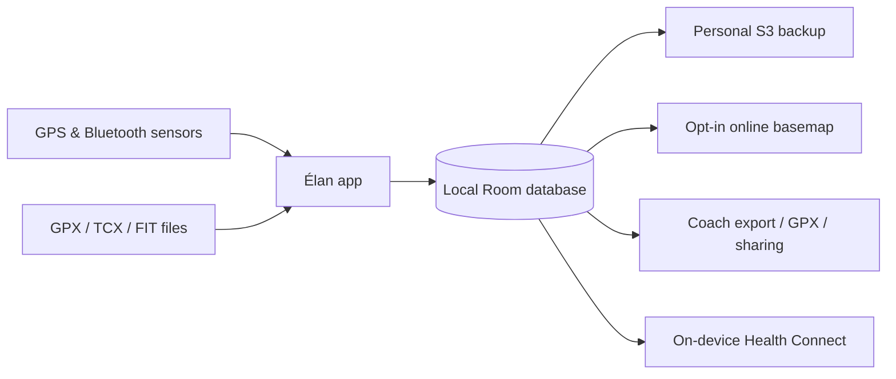
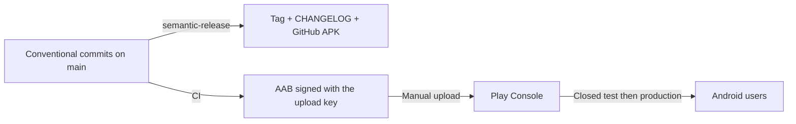

# Élan 🚴‍♂️🏋️

[](https://github.com/Wifsimster/elan/releases/latest)

Élan is a personal **fitness-tracking** mobile app, built for **cycling**,
**running**, **walking** and **strength training**. It works **100% offline**:
no data ever leaves your phone, with no account and no server.

> 🔒 **Your data stays on your device.** Everything is stored in a local
> database. The only network connections are **optional** and configured by
> you (backup and map tiles on your own servers).

---

## Table of contents

- [Download](#download)
- [What is it for?](#what-is-it-for)
- [Screenshots](#screenshots)
- [Key features](#key-features)
- [How it works](#how-it-works)
- [Environments](#environments)
- [Permissions](#permissions)
- [Build](#build)
- [Deployment](#deployment)
- [Tech stack](#tech-stack)
- [Further documentation](#further-documentation)

### Technical documentation

| Document | Description |
|----------|-------------|
| [Bluetooth sensors](docs/CAPTEURS.md) | Pair a heart-rate strap or a bike sensor, auto-reconnect, troubleshooting |
| [Import your activities](docs/IMPORT.md) | Bring in past activities from GPX, TCX or FIT files |
| [Data backup](docs/SAUVEGARDE.md) | Configure the optional backup to your own S3 server |
| [“Coach” export for an AI](docs/EXPORT-COACH.md) | Generate a Markdown or JSON training report to be analysed by an AI |
| [Upgrading from Élan 1.x](docs/MIGRATION-1.x.md) | What happens when 2.0 installs over 1.9.0, and how to roll back |
| [Play Store publishing guide](docs/PUBLISHING.md) | Upload key, release flow, Play Console declarations |
| [Data safety](docs/DATA_SAFETY.md) | Ready-to-use answers for the Play Console “Data safety” questionnaire |
| [Privacy policy](PRIVACY.md) | The app's privacy commitment (public text) |
| [Sillage design system](DESIGN.md) | Visual rules: colors, typography, components, Compose implementation |

---

## Download

The Android **APK** of every tagged version is attached to the matching
[GitHub release](https://github.com/Wifsimster/elan/releases/latest) — no store
account needed.

1. Download `elan-<version>.apk` from the
   [latest release](https://github.com/Wifsimster/elan/releases/latest).
2. Check its `sha256` against the attached `SHA256SUMS.txt`
   (`sha256sum -c SHA256SUMS.txt`).
3. Open the file on your phone and allow installation from this source when
   Android asks.

> Requires **Android 8.0 (API 26)** or newer. The APK is universal
> (`arm64-v8a`, `armeabi-v7a`, `x86`, `x86_64`). If a Play Store build of Élan
> is already installed, uninstall it first — the two are signed with different
> keys.

The APK is built by the [`Release native`](.github/workflows/release-native.yml)
workflow (semantic-release + Gradle, entirely on the GitHub runner). The
[`Build native APK`](.github/workflows/build-native.yml) workflow additionally
uploads build artifacts on every push and publishes a rolling `latest`
release. Signing details are covered in the
[publishing guide](docs/PUBLISHING.md).

> Coming from **Élan 1.x**? 2.0 installs over it and imports your data
> automatically: see [MIGRATION-1.x.md](docs/MIGRATION-1.x.md).

---

## What is it for?

- **Measure your rides, runs and walks** in real time: distance, speed or
  pace, elevation gain and GPS trace.
- **Track your strength-training sessions**: exercises, sets, weight lifted,
  perceived effort and progression.
- **Record your heart rate** via a Bluetooth strap to estimate effort, heart
  rate zones and calories.
- **Keep the history** of all your activities, records and body weight, and
  visualize your progress over time.
- **Stay in control of your data**: everything is local; backups and maps
  remain under your control.

---

## Screenshots

<table>
  <tr>
    <td align="center" width="33%">
      <br />
      <sub><b>Dashboard</b><br />Weekly summary & 7-day activity</sub>
    </td>
    <td align="center" width="33%">
      <br />
      <sub><b>Bike ride</b><br />Route map, records & stats</sub>
    </td>
    <td align="center" width="33%">
      <br />
      <sub><b>Speed & elevation</b><br />Detailed session charts</sub>
    </td>
  </tr>
  <tr>
    <td align="center" width="33%">
      <br />
      <sub><b>History</b><br />Every session, filterable by type</sub>
    </td>
    <td align="center" width="33%">
      <br />
      <sub><b>Strength progression</b><br />Load tracking, exercise by exercise</sub>
    </td>
    <td align="center" width="33%">
      <br />
      <sub><b>Sensors</b><br />Bluetooth heart-rate strap & bike sensors</sub>
    </td>
  </tr>
</table>

---

## Key features

- **Live GPS outing** (cycling, running, walking) — Stopwatch, distance,
  instant and max speed or pace, elevation gain, calories, live trace;
  foreground service to keep recording with the screen off; GPS filtering
  (accuracy gate, Kalman, altitude hysteresis); Strava-style moving time;
  session recovered after a crash; activity type editable afterwards.
- **Live strength session** — Exercises, sets (reps × weight), easy/medium/hard
  feedback, rest timer with chime, total volume; draft resumable after a pause
  or a kill.
- **Exercise catalog** — Cards with photos, targeted muscles, execution notes
  and a load recommendation based on your profile; four ready-made programs
  (Full-body A/B, Back / lower back, Neck).
- **Weekly plan & reminders** — One activity per day, reminders at the hour of
  your choice (re-scheduled after a reboot).
- **Automatic progression** — Weekly adjustment of program loads from your
  perceived effort, with a summary of the changes.
- **Bluetooth heart-rate strap & bike sensors** — Auto-connect on launch,
  reconnect after a drop, cadence and wheel speed (up to two sensors,
  configurable tyre size).
- **Heart rate zones, records and effort** — Time per zone, personal and
  yearly records, per-session effort indicator.
- **Dashboard** — Weekly summary (trend vs last week), goals, 7-day activity
  chart.
- **History & detail** — Search, filters by type and period, detail page
  (trace, speed/elevation/HR charts, exercises).
- **Weight journal** — Weigh-ins, trend, 30-day delta; the profile follows
  the latest entry.
- **File import** — GPX, TCX or FIT (`.gz` accepted), duplicates ignored.
- **GPX export & sharing** — GPX of an outing (with a privacy zone), shareable
  session image.
- **Backup to your own server** — JSON snapshot to your S3-compatible storage
  (optional, automatic after each session), configurable by QR code.
- **“Coach” export** — Markdown report or raw JSON for your own tracking tool
  or an AI.
- **Health Connect** — Opt-in export of sessions (session, distance, calories,
  HR) to the device's health store, write-only.
- **Online basemap** — Opt-in (OpenFreeMap or your own MapLibre server), plain
  offline trace otherwise.
- **Edge-to-edge, light/dark theme, landscape**, reduced motion respected.

---

## How it works


```mermaid
graph LR
    A[GPS & Bluetooth sensors] --> B[Élan app]
    F[GPX / TCX / FIT files] --> B
    B --> C[(Local Room database)]
    C --> D[Personal S3 backup]
    C --> E[Opt-in online basemap]
    C --> G[Coach export / GPX / sharing]
    C --> H[On-device Health Connect]
```

The app collects data during the session using GPS and Bluetooth sensors.
Everything is stored in a **local database** on the phone. You can also
**import** past activities from files. External connections (backup, maps) are
**optional** and point to **your own servers**.

---

## Environments

The app is **local**: it depends on no vendor server. The network services
below are configured by the user and disabled by default.

| Service | Configuration | Description |
|---------|---------------|-------------|
| Database | Automatic | Local Room/SQLite storage on the device (no action required) |
| S3 backup | User-provided | S3-compatible server (self-hosted MinIO, SeaweedFS, Garage…), HTTPS required |
| Map tiles | Opt-in (off by default) | OpenFreeMap (free, open source) or a self-hosted MapLibre tile server |
| Health Connect | Opt-in | Health store **on the device**, no network |

> With no configuration, the app remains fully functional and the map falls
> back to a network-free vector trace.

---

## Permissions

Declared in [`app/src/main/AndroidManifest.xml`](app/src/main/AndroidManifest.xml):

| Permission | Purpose |
|------------|---------|
| `INTERNET` | S3 backup and map tiles, only if you enable them |
| `ACCESS_FINE_LOCATION`, `ACCESS_COARSE_LOCATION` | GPS trace of an outing, foreground only (no background location) |
| `FOREGROUND_SERVICE`, `FOREGROUND_SERVICE_LOCATION`, `WAKE_LOCK` | Foreground service during an outing, to keep recording with the screen off |
| `BLUETOOTH_SCAN` (`neverForLocation`), `BLUETOOTH_CONNECT`; `BLUETOOTH`, `BLUETOOTH_ADMIN` (Android ≤ 11) | Heart-rate strap and cadence/speed sensors; Bluetooth LE is not required to install the app |
| `POST_NOTIFICATIONS` | Live-session notification, reminders, program progression |
| `RECEIVE_BOOT_COMPLETED` | Re-schedule reminders after a reboot |
| `android.permission.health.WRITE_EXERCISE`, `WRITE_DISTANCE`, `WRITE_ACTIVE_CALORIES_BURNED`, `WRITE_HEART_RATE` | Opt-in Health Connect export, write-only |

No camera (the configuration QR code goes through the Google Play Services
code scanner), no microphone, no external storage access, no Android backup
(`allowBackup="false"`).

**Privacy**: no account, no vendor server, no ads, no tracker or analytics, no
third-party data-collection SDK. The only data leaving the device are the flows
you trigger yourself (backup to your server, basemap, sharing). Full text:
[PRIVACY.md](PRIVACY.md).

---

## Build

Requires JDK 17 and the Android SDK (platform 36).

```bash
./gradlew testDebugUnitTest assembleDebug   # JVM tests (JUnit, Robolectric, Compose) + debug APK
./gradlew assembleRelease                   # minified (R8) release APK → app/build/outputs/apk/release/app-release.apk
./gradlew bundleRelease                     # Play Store AAB → app/build/outputs/bundle/release/app-release.aab
```

Without `keystore.properties` or `KEYSTORE_*` environment variables, release
builds are debug-signed (installable, but not for the Play Store). Development
conventions live in `CLAUDE.md` and `AGENTS.md` (in French).

---

## Deployment


```mermaid
graph LR
    A[Conventional commits on main] -->|semantic-release| B[Tag + CHANGELOG + GitHub APK]
    A -->|CI| C[AAB signed with the upload key]
    C -->|Manual upload| D[Play Console]
    D -->|Closed test then production| E[Android users]
```

On every push to `main`, **semantic-release** computes the version from the
commits, updates `gradle.properties` and `CHANGELOG.md`, creates the tag and
the GitHub release with the APK. The signed AAB produced by CI is uploaded to
the **Play Console**, validated in closed testing, then published. Full details
are in the [publishing guide](docs/PUBLISHING.md).

---

## Tech stack

| Concern | Choice |
|---------|--------|
| Language | Kotlin 2.0, JVM 17 |
| UI | Jetpack Compose + Material 3 Expressive, Sillage design system |
| Persistence | Room (schema exported to `app/schemas/`) |
| DI | Hilt |
| Async | Coroutines + Flow |
| Background work | WorkManager (backup), foreground service (GPS), AlarmManager (reminders) |
| Networking | OkHttp (hand-written S3 SigV4 client), opt-in only |
| Maps | MapLibre (opt-in), offline Compose Canvas otherwise |
| Sensors | Android Bluetooth LE APIs (Heart Rate, Cycling Speed and Cadence) |
| Health | Health Connect (write-only) |
| QR | Google Play Services code scanner |
| Tests | JUnit 4, Robolectric, MockK, Compose UI test, MockWebServer — all on the JVM |

`minSdk 26` (Android 8.0) · `targetSdk 36` · single-activity, MVVM. The UI is
in French.

```
app/src/main/java/ovh/battistella/elan/
├─ domain/      Pure JVM logic: activities, calories, GPS filter, HR zones, Strava import, programs…
├─ data/        Room (local) · settings · S3 backup · KeyStore secrets · exports · 1.x import (legacy)
├─ tracking/    GPS foreground service, outing controller, crash recovery
├─ sensors/ble/ Heart-rate strap and cadence/speed sensors
├─ health/      Health Connect
├─ maps/        MapLibre (style, view, snapshots)
├─ sync/        WorkManager (backup), reminders, weekly progression
├─ ui/          Compose: PULSE theme, components, navigation, screens
├─ di/          Hilt modules
├─ ElanApp      Application — WorkManager + startup tasks
└─ MainActivity
```

---

## Further documentation

- [Bluetooth sensors](docs/CAPTEURS.md) — Pairing a heart-rate strap & bike sensor.
- [Import your activities](docs/IMPORT.md) — Importing GPX, TCX and FIT files.
- [Data backup](docs/SAUVEGARDE.md) — Optional S3 backup.
- [“Coach” export for an AI](docs/EXPORT-COACH.md) — Training report for an AI.
- [Upgrading from Élan 1.x](docs/MIGRATION-1.x.md) — Automatic data import.
- [Play Store publishing guide](docs/PUBLISHING.md) — Publishing to the Google Play Store.
- [Data safety](docs/DATA_SAFETY.md) — Play Console questionnaire.
- [Privacy policy](PRIVACY.md) — The app's public privacy text.
- [Sillage design system](DESIGN.md) — Visual rules and Compose implementation.
- [Asset licenses](docs/LICENSES-ASSETS.md) — Bundled icons, photos, sounds.
- [Changelog](CHANGELOG.md) — Version history.

> All documents under `docs/` are written in French.
