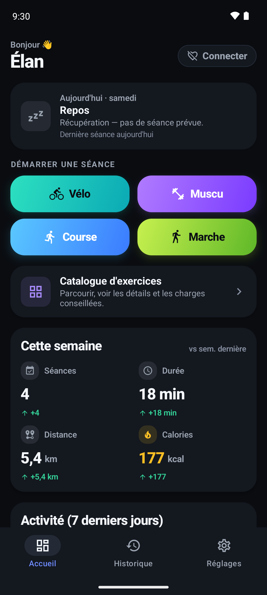
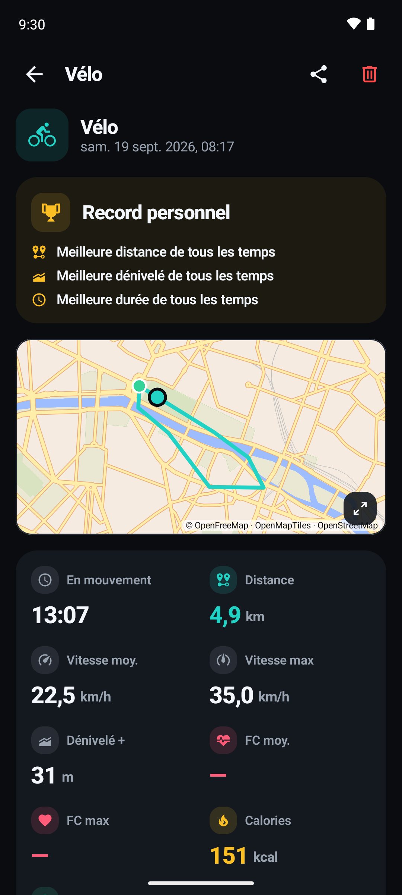
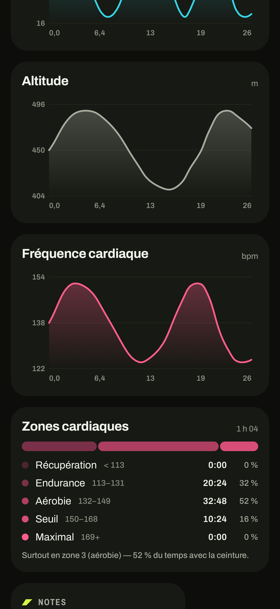
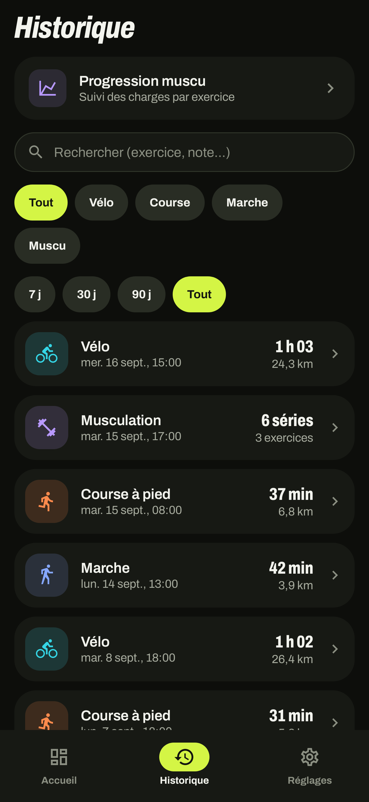
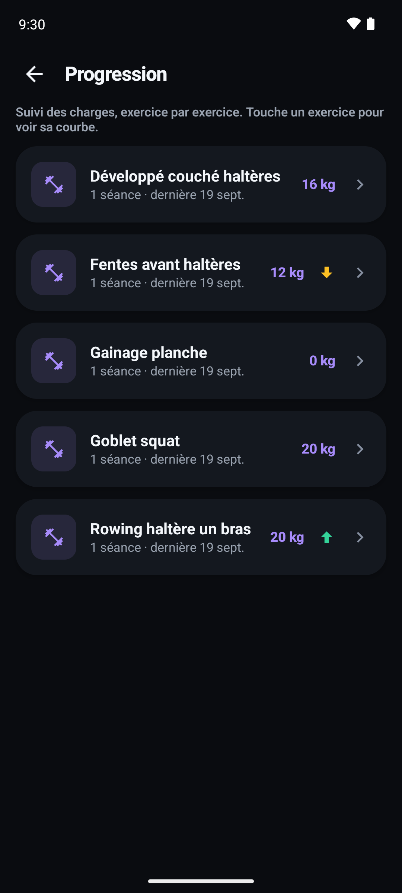
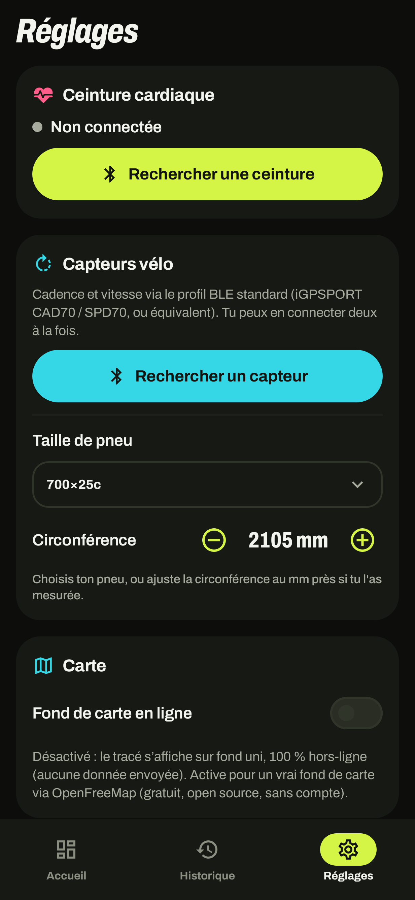
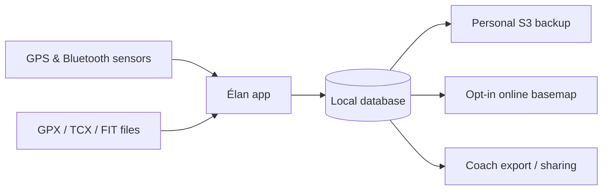
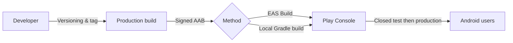

# Élan 🚴‍♂️🏋️

Élan is a personal **fitness-tracking** mobile app, built for **cycling** and **strength training**. It works **100% offline**: no data ever leaves your phone, with no account and no server.

> 🔒 **Your data stays on your device.** Everything is stored in a local database. The only network connections are **optional** and configured by you (backup and map tiles on your own servers).

---

## Table of contents

- [What is it for?](#what-is-it-for)
- [Screenshots](#screenshots)
- [Key features](#key-features)
- [How it works](#how-it-works)
- [Environments](#environments)
- [Deployment](#deployment)
- [Tech stack](#tech-stack)
- [Further documentation](#further-documentation)

### Technical documentation

| Document | Description |
|----------|-------------|
| [Bluetooth sensors](docs/CAPTEURS.md) | Pair a heart-rate strap or a bike sensor, auto-reconnect, troubleshooting |
| [Import your activities](docs/IMPORT.md) | Bring in past activities from GPX, TCX or FIT files |
| [Data backup](docs/SAUVEGARDE.md) | Configure the optional backup to your own S3 server |
| [“Coach” export for an AI](docs/EXPORT-COACH.md) | Generate a Markdown or JSON training report to be analysed by an AI |
| [Play Store publishing guide](docs/PUBLISHING.md) | Step-by-step process to publish the app on the Google Play Store |
| [Data safety](docs/DATA_SAFETY.md) | Ready-to-use answers for the Play Console “Data safety” questionnaire |
| [Privacy policy](PRIVACY.md) | The app's privacy commitment (public text) |
| [PULSE design system](DESIGN.md) | Visual rules: colors, typography, components |

---

## What is it for?

- **Measure your bike rides** in real time: distance, speed, elevation gain and route trace.
- **Track your strength-training sessions**: exercises, sets, weight lifted and progression.
- **Record your heart rate** via a Bluetooth strap to estimate effort and calories.
- **Keep the history** of all your activities and visualize your progress over time.
- **Stay in control of your data**: everything is local; backups and maps remain under your control.

---

## Screenshots

<table>
  <tr>
    <td align="center" width="33%">
       
      <b>Dashboard</b> Weekly summary & 7-day activity
    </td>
    <td align="center" width="33%">
       
      <b>Bike ride</b> Route map, records & stats
    </td>
    <td align="center" width="33%">
       
      <b>Speed & elevation</b> Detailed session charts
    </td>
  </tr>
  <tr>
    <td align="center" width="33%">
       
      <b>History</b> Every session, filterable by type
    </td>
    <td align="center" width="33%">
       
      <b>Strength progression</b> Load tracking, exercise by exercise
    </td>
    <td align="center" width="33%">
       
      <b>Sensors</b> Bluetooth heart-rate strap & bike sensors
    </td>
  </tr>
</table>

---

## Key features

- **Live bike session** — Stopwatch, distance, instant and max speed, elevation gain, GPS trace and estimated calories.
- **Live strength session** — Exercises, sets (reps × weight), total volume lifted and duration.
- **Bluetooth heart-rate strap** — Automatic connection to your heart-rate sensor and reconnect on launch.
- **Bike cadence/speed sensor** — Support for Bluetooth bike sensors (cadence and wheel speed).
- **Strength programs** — Ready-to-use session templates (full-body, back, neck) to get started quickly.
- **Weekly planning** — Organize your sessions across the week, with optional reminders on the scheduled day.
- **Dashboard** — Weekly summary and 7-day activity chart.
- **History & detail** — Every session filterable by type, with a detail page (trace, charts, exercises).
- **Progression** — Load and performance tracking, exercise by exercise.
- **File import** — Bring back your past rides from GPX, TCX or FIT files (Strava, other apps).
- **Image sharing** — Generate a visual session card to share.
- **Backup to your own server** — Export encrypted in transit to your own S3-compatible storage (optional).
- **“Coach” export** — An AI-readable training report to drop into your own tracking tool.

---

## How it works

```mermaid
graph LR
    A[GPS & Bluetooth sensors] --> B[Élan app]
    F[GPX / TCX / FIT files] --> B
    B --> C[(Local database)]
    C --> D[Personal S3 backup]
    C --> E[Opt-in online basemap]
    C --> G[Coach export / sharing]
```

The app collects data during the session using GPS and Bluetooth sensors. Everything is stored in a **local database** on the phone. You can also **import** past activities from files. External connections (backup, maps) are **optional** and point to **your own servers**.

---

## Environments

The app is **local**: it depends on no vendor server. The network services below are configured by the user and disabled by default.

| Service | Configuration | Description |
|---------|---------------|-------------|
| Database | Automatic | Local storage on the device (no action required) |
| S3 backup | User-provided | S3-compatible server (e.g. self-hosted MinIO or SeaweedFS) |
| Map tiles | Opt-in (off by default) | OpenFreeMap (free, open source) or a self-hosted MapLibre tile server |

> With no configuration, the app remains fully functional and the map falls back to a network-free vector trace.

---

## Deployment

```mermaid
graph LR
    A[Developer] -->|Versioning & tag| B[Production build]
    B -->|Signed AAB| C{Method}
    C -->|EAS Build| D[Play Console]
    C -->|Local Gradle build| D
    D -->|Closed test then production| E[Android users]
```

Distribution goes through the **Google Play Store**. A production release (App Bundle `.aab`) is produced either in the cloud via **EAS Build** or **locally** with Gradle. The signed app is then uploaded to the **Play Console**, validated in closed testing, and published. The full details are in the [publishing guide](docs/PUBLISHING.md).

---

## Tech stack

- **App:** Expo SDK 56, React Native 0.85, React 19, TypeScript
- **Navigation:** Expo Router (typed routes)
- **Storage:** `expo-sqlite` (local database, versioned migrations)
- **Sensors:** `expo-location` (GPS), `react-native-ble-plx` (Bluetooth heart-rate & cadence)
- **Maps:** MapLibre — opt-in online basemap (OpenFreeMap or self-hosted) with a `react-native-svg` vector fallback offline
- **Target:** Android (iOS configured but secondary)

---

## Further documentation

- [Bluetooth sensors](docs/CAPTEURS.md) — Pairing a heart-rate strap & bike sensor.
- [Import your activities](docs/IMPORT.md) — Importing GPX, TCX and FIT files.
- [Data backup](docs/SAUVEGARDE.md) — Optional S3 backup.
- [“Coach” export for an AI](docs/EXPORT-COACH.md) — Training report for an AI.
- [Play Store publishing guide](docs/PUBLISHING.md) — Publishing to the Google Play Store.
- [Data safety](docs/DATA_SAFETY.md) — Play Console questionnaire.
- [Privacy policy](PRIVACY.md) — The app's public privacy text.
- [PULSE design system](DESIGN.md) — The app's visual rules.
- [Changelog](CHANGELOG.md) — Version history.

> **Note for developers:** Bluetooth requires a *development build* (`npx expo run:android`); it does not work in Expo Go. Detailed technical instructions are in `CLAUDE.md` and `AGENTS.md`.
</content>
</invoke>
