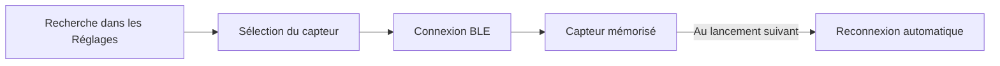

# Capteurs Bluetooth (cardio & vélo)

Ce document explique comment connecter vos **capteurs Bluetooth** à Élan. Il
s'adresse à l'utilisateur qui possède une ceinture cardiaque ou un capteur de
cadence/vitesse vélo.

## En bref

- Élan se connecte aux capteurs **Bluetooth Low Energy (BLE)** standards.
- Deux familles de capteurs : **ceinture cardiaque** et **capteur vélo**
  (cadence et vitesse).
- La connexion est **automatique au lancement** : le dernier capteur appairé est
  retrouvé tout seul.

> ⚠️ **Important.** Le Bluetooth ne fonctionne **pas** dans Expo Go. Un
> *development build* de l'application est nécessaire (voir `CLAUDE.md`).

## Capteurs pris en charge

| Type | Profil Bluetooth standard | Mesure |
|------|---------------------------|--------|
| Ceinture cardiaque | Heart Rate (service `0x180D`) | Fréquence cardiaque (bpm) |
| Capteur vélo | Cycling Speed and Cadence (service `0x1816`) | Cadence et vitesse roue |

Tout capteur conforme à ces profils GATT standards convient. Les capteurs vélo
iGPSPORT CAD70 (cadence) et SPD70 (vitesse) sont par exemple compatibles.

## Comment ça marche

Vous lancez une recherche, choisissez votre capteur, l'application s'y connecte
et **mémorise** l'appareil. Aux lancements suivants, la reconnexion est
automatique.

> **Détail technique.** L'application maintient **une seule** connexion
> Bluetooth par type de capteur, partagée par tous les écrans. La fréquence
> cardiaque est gérée globalement à la racine de l'application ; le capteur de
> cadence/vitesse l'est de la même façon. La vitesse est calculée à partir des
> tours de roue et de la **taille de roue** configurée.

## Appairer un capteur

1. Allumez le capteur et placez-le à portée.
2. Ouvrez **Réglages**.
3. Lancez la recherche (cardio ou vélo) et sélectionnez votre capteur.

## Dépannage

| Problème | Piste |
|----------|-------|
| Aucun capteur trouvé | Vérifiez que le Bluetooth et la localisation sont activés, et que le capteur est allumé et à portée |
| La connexion échoue | Coupez/rallumez le capteur, puis relancez la recherche |
| Pas de reconnexion auto | Rouvrez les Réglages et relancez une recherche pour ré-appairer |
| Vitesse incohérente (capteur vélo) | Vérifiez la **taille de roue** configurée |
