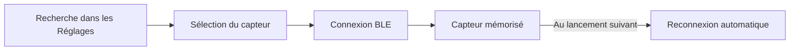

# Capteurs Bluetooth (cardio & vélo)

Ce document explique comment connecter vos **capteurs Bluetooth** à Élan. Il
s'adresse à l'utilisateur qui possède une ceinture cardiaque ou un capteur de
cadence/vitesse vélo.

## En bref

- Élan se connecte aux capteurs **Bluetooth Low Energy (BLE)** standards.
- Deux familles de capteurs : **ceinture cardiaque** et **capteur vélo**
  (cadence et vitesse, jusqu'à deux capteurs en même temps).
- La connexion est **automatique au lancement** : le dernier capteur appairé est
  retrouvé tout seul, et retrouvé à nouveau si le Bluetooth est coupé puis
  rallumé.
- Le Bluetooth n'est **pas obligatoire** : sans radio BLE, l'application
  s'installe et fonctionne, les cartes capteurs affichent « Non disponible ».

## Capteurs pris en charge

| Type | Profil Bluetooth standard | Mesure |
|------|---------------------------|--------|
| Ceinture cardiaque | Heart Rate (service `0x180D`, caractéristique `0x2A37`) | Fréquence cardiaque (bpm) |
| Capteur vélo | Cycling Speed and Cadence (service `0x1816`, caractéristique `0x2A5B`) | Cadence (tr/min) et vitesse roue (km/h) |

Tout capteur conforme à ces profils GATT standards convient. Les capteurs vélo
iGPSPORT CAD70 (cadence) et SPD70 (vitesse) sont par exemple compatibles.

## Comment ça marche

```mermaid
graph LR
    A[Recherche dans les Réglages] --> B[Sélection du capteur]
    B --> C[Connexion BLE]
    C --> D[Capteur mémorisé]
    D -->|Au lancement suivant| E[Reconnexion automatique]
```

Vous lancez une recherche, choisissez votre capteur, l'application s'y connecte
et **mémorise** l'appareil. Aux lancements suivants, la reconnexion est
automatique. Si la liaison tombe pendant une séance, l'application retente
seule (cinq essais espacés de 1 s à 15 s) avant de repasser en « Non connectée ».

> **Détail technique.** Les capteurs vivent dans `sensors/ble/` : un
> `HeartRateManager` (une ceinture) et un `CadenceSpeedManager` (jusqu'à deux
> capteurs CSC), tous deux singletons Hilt partagés par tous les écrans — aucun
> écran n'ouvre sa propre connexion. Le scan (`BleScanner`) filtre par UUID de
> service et s'arrête seul après 20 s ; la connexion GATT (`GattLink`) a un
> délai de 10 s. Les trames sont décodées par `GattFrames.kt`
> (`parseHeartRate`, `parseCsc`, avec gestion du débordement des compteurs de
> tours). Les capteurs mémorisés sont stockés dans les réglages `hr_device`,
> `csc_devices` et la circonférence dans `csc_wheel_mm`, aux mêmes clés que
> dans Élan 1.x.

### Pendant une sortie GPS

Les mesures cardio et de cadence arrivent en continu et sont **rapprochées de
chaque point GPS** (à ±10 s près) au moment de l'enregistrement, pour alimenter
la fréquence cardiaque moyenne/max, les zones cardiaques et la cadence
moyenne/max de la séance (`tracking/TrackingController.kt`,
`domain/Samples.kt`). La vitesse roue est affichée en direct mais ce sont les
points GPS qui font foi pour la distance et la vitesse enregistrées.

## Appairer un capteur

1. Allumez le capteur et placez-le à portée (pour un capteur vélo, faites
   tourner la roue ou la manivelle pour le réveiller).
2. Ouvrez **Réglages**.
3. Carte **Ceinture cardiaque** → « Rechercher une ceinture », ou carte
   **Capteurs vélo** → « Rechercher un capteur », puis sélectionnez votre
   appareil dans la liste.

Android demande alors les permissions Bluetooth (« Appareils à proximité » sur
Android 12+, la localisation sur les versions antérieures — exigence du système
pour le scan BLE, jamais utilisée pour vous localiser).

### Taille de roue (capteur vélo)

La vitesse est calculée à partir des tours de roue et de la **circonférence**
configurée (2105 mm par défaut, soit un pneu 700×25c). Choisissez votre pneu
dans la liste (`domain/WheelSizes.kt`) ou ajustez la valeur au millimètre près
(1000–2400 mm) si vous l'avez mesurée.

## Dépannage

| Problème | Piste |
|----------|-------|
| Aucun capteur trouvé | Vérifiez que le Bluetooth est activé, que les permissions ont été accordées, et que le capteur est allumé, réveillé et à portée ; la recherche s'arrête seule au bout de 20 s, relancez-la |
| « Permissions Bluetooth refusées » | Autorisez « Appareils à proximité » (Android 12+) ou la localisation dans les réglages système de l'application |
| La connexion échoue | Coupez/rallumez le capteur, puis relancez la recherche |
| Pas de reconnexion auto | Rouvrez les Réglages et relancez une recherche pour ré-appairer |
| Vitesse incohérente (capteur vélo) | Vérifiez la **taille de pneu** / circonférence configurée |
| Cadence ou vitesse figée à 0 | Normal après 3 s sans tour de roue ou de manivelle ; la valeur repart au premier mouvement |
