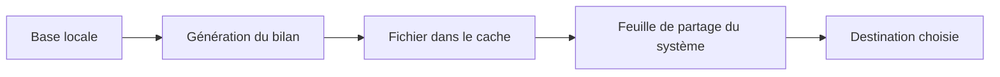

# Export « coach » pour une IA

Ce document explique l'export conçu pour alimenter un **coach IA**. Il s'adresse
à l'utilisateur qui veut faire analyser ou suivre sa programmation par un outil
comme un projet Claude Code.

## En bref

- L'export génère un **bilan d'entraînement** lisible par une IA.
- Deux formats au choix : un **bilan Markdown** synthétique, ou un **export JSON
  brut** complet.
- L'opération est **hors-ligne** : le fichier est écrit localement, puis le
  partage est délégué au système.

> **L'idée.** Vous déposez le bilan dans un projet d'IA dédié au suivi de votre
> entraînement. L'IA dispose alors de votre programme, votre planning et votre
> historique pour vous conseiller.

## Les deux formats

| Format | Contenu | Usage |
|--------|---------|-------|
| **Bilan Markdown** | Programme, planning, statistiques, progression et historique, mis en forme | À lire par une IA ou un humain |
| **Export JSON brut** | Profil, programme et instantané complet de la base | Traitement automatisé, tableur, archivage |

## Comment ça marche

L'application construit le fichier à partir de vos données, l'écrit dans un
dossier temporaire, puis ouvre la **feuille de partage** d'Android. Vous
choisissez la destination : Drive, e-mail, gestionnaire de fichiers, etc.

## Utilisation

1. Ouvrez **Réglages → Exporter mes données**.
2. Choisissez le format (**Markdown** ou **JSON**).
3. Sélectionnez la destination dans la feuille de partage.

## Confidentialité

- Le fichier est généré **localement** ; aucune donnée n'est envoyée par
  l'application elle-même.
- C'est **vous** qui choisissez la destination du partage. Pensez-y : envoyer le
  bilan vers un service en ligne le fait sortir de l'appareil.

> **Détail technique.** Le bilan est assemblé par `lib/coach-export.ts`
> (`buildCoachMarkdown` / `buildCoachJson`) à partir des fonctions de la base.
> Le partage passe par `expo-sharing` ; aucun appel réseau n'est effectué par
> l'application.
