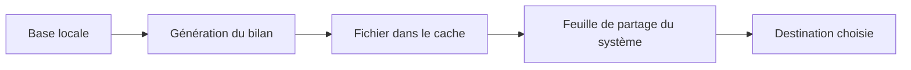

# Export « coach » pour une IA

Ce document explique l'export conçu pour alimenter un **coach IA**. Il s'adresse
à l'utilisateur qui veut faire analyser ou suivre sa programmation par un outil
comme un projet Claude Code.

## En bref

- L'export génère un **bilan d'entraînement** lisible par une IA.
- Deux formats au choix : un **bilan Markdown** synthétique, ou un **export JSON
  brut** complet.
- L'opération est **hors-ligne** : le fichier est écrit localement, puis le
  partage est délégué au système.

> **L'idée.** Vous déposez le bilan dans un projet d'IA dédié au suivi de votre
> entraînement. L'IA dispose alors de votre programme, votre planning et votre
> historique pour vous conseiller.

## Les deux formats

| Format | Fichier | Contenu | Usage |
|--------|---------|---------|-------|
| **Bilan Markdown** | `suivi-sport-coach.md` | Profil, poids, programme et planning, statistiques (7/30/90 j, total), objectifs, progression par exercice, détail des séances muscu, historique des sorties | À lire par une IA ou un humain |
| **Export JSON brut** | `suivi-sport-export.json` | Profil, programme et instantané complet de la base (même contenu que la sauvegarde S3, tracés GPS inclus) | Traitement automatisé, tableur, archivage |

Le bilan Markdown ne contient **aucune coordonnée GPS** : seulement des
agrégats par sortie (date, distance, vitesse ou allure, FC, dénivelé,
calories). L'export JSON, lui, contient les points bruts.

## Comment ça marche

```mermaid
graph LR
    A[Base locale] --> B[Génération du bilan]
    B --> C[Fichier dans le cache]
    C --> D[Feuille de partage du système]
    D --> E[Destination choisie]
```

L'application construit le fichier à partir de vos données, l'écrit dans un
dossier temporaire, puis ouvre la **feuille de partage** d'Android. Vous
choisissez la destination : Drive, e-mail, gestionnaire de fichiers, etc.

## Utilisation

1. Ouvrez **Réglages → Exporter mes données**.
2. Choisissez le format (**Exporter le bilan (Markdown)** ou **Exporter les
   données brutes (JSON)**).
3. Sélectionnez la destination dans la feuille de partage.

## Confidentialité

- Le fichier est généré **localement** ; aucune donnée n'est envoyée par
  l'application elle-même.
- C'est **vous** qui choisissez la destination du partage. Pensez-y : envoyer le
  bilan vers un service en ligne le fait sortir de l'appareil.
- La **zone de confidentialité** (Réglages, 100/200/500 m) masque le départ et
  l'arrivée d'un tracé dans l'**export GPX** d'une séance ; elle ne s'applique
  pas à l'export JSON brut, qui reste une copie intégrale.

> **Détail technique.** Le bilan est assemblé par
> `data/export/CoachExporter.kt` (`buildMarkdown` / `buildJson`) depuis les
> dépôts Room ; le JSON réutilise l'encodeur de sauvegarde
> (`BackupSnapshotCodec.writeSnapshot`) avec les mêmes réglages exclus. Les
> fichiers sont écrits dans `cache/share/`, seul dossier exposé par le
> `FileProvider` `${applicationId}.files` (`res/xml/file_paths.xml`), et
> partagés par `data/export/FileShare.kt` (`ACTION_SEND`) ; aucun appel réseau
> n'est effectué par l'application.
