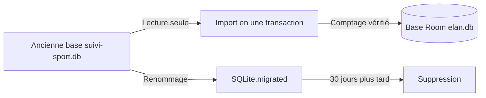

# Mise à jour depuis Élan 1.x

Ce document explique ce qui se passe quand **Élan 2.0** (application native
Kotlin) s'installe par-dessus **Élan 1.9.0** (application Expo / React Native).
Il s'adresse à l'utilisateur qui met à jour, et, en fin de document, à la
personne qui maintient le projet.

## En bref

- La mise à jour se fait **en place** : même nom de paquet
  (`ovh.battistella.elan`), pas de désinstallation, à condition de rester sur
  la même source (Play Store → Play Store, ou APK GitHub → APK GitHub : les
  deux sources ne sont pas signées de la même clé et ne s'échangent pas).
- Au premier lancement, vos **séances, points GPS, séries, pesées et réglages**
  sont repris automatiquement dans la nouvelle base. Aucune action de votre
  part.
- Les **identifiants S3** de la sauvegarde sont déchiffrés et repris eux aussi ;
  si ce n'est pas possible, l'application vous demande de les ressaisir.
- L'ancienne base est **conservée un mois** sur l'appareil comme filet de
  sécurité, puis supprimée.

## Ce qui se passe au premier lancement

1. L'écran sombre « Mise à jour de vos données… » s'affiche avec une barre de
   progression (les points GPS sont l'étape longue). L'interface habituelle
   n'apparaît **qu'une fois l'import terminé**, pour qu'aucun écran ne lise une
   base à moitié remplie.
2. L'ancienne base `files/SQLite/suivi-sport.db` est ouverte, son journal WAL
   fusionné, son intégrité vérifiée (`PRAGMA integrity_check`), puis elle est
   passée en lecture seule.
3. Toutes les lignes de `sessions`, `track_points`, `muscu_sets`,
   `body_measurements` et `settings` sont copiées dans la base Room `elan.db`
   dans **une seule transaction**, en conservant les identifiants d'origine
   (vos sauvegardes S3 et exports coach restent cohérents). Les compteurs
   `sqlite_sequence` sont réalignés pour qu'un identifiant libéré ne soit jamais
   réattribué. Un comptage table par table valide la copie avant validation.
4. Les identifiants S3 sont relus depuis le coffre d'expo-secure-store et
   rangés dans le nouveau coffre Android KeyStore.
5. Le dossier `files/SQLite` est renommé `files/SQLite.migrated`. Trente jours
   plus tard, au premier lancement suivant l'échéance, ce dossier et les
   préférences Expo restantes (`SecureStore.xml`, gestionnaire de tâches,
   notifications) sont supprimés.

L'import est **idempotent** : une fois marqué comme fait, il ne se rejoue pas.
Si l'application est tuée en plein import, la transaction est annulée et la
copie repart de zéro au lancement suivant, l'ancienne base étant intacte.

> **Détail technique.** `data/legacy/LegacyPaths.kt` (emplacements),
> `LegacyDbReader.kt` (lecture brute, ajout idempotent des colonnes v2→v7 sur
> une base restée en version antérieure, sans rétro-calcul),
> `LegacyDatabaseImporter.kt` (copie, vérification, secrets, renommage,
> purge), `LegacySecretsReader.kt` (AES/GCM avec la clé `AES/GCM/NoPadding:key_v1`
> de l'Android KeyStore créée par expo-secure-store) et `MigrationGate.kt`
> (barrière de démarrage, jusqu'à `MAX_AUTO_ATTEMPTS = 3` tentatives
> automatiques). Le tout est piloté par `StartupTasks.kt` et affiché par
> `ui/screens/migration/MigrationScreen.kt`. La base Room démarre en
> version 8 : le schéma v7 de l'app 1.x repris tel quel, +1 pour distinguer
> `elan.db` de `suivi-sport.db` (`data/local/ElanDatabase.kt`).

## Si l'import échoue

Après trois tentatives automatiques (ou une seule si l'échec n'est pas
rejouable), l'écran « La reprise de vos données a échoué » affiche la cause et
rappelle que vos anciennes données sont intactes. Deux options :

| Bouton | Effet |
|--------|-------|
| **Réessayer** | Relance une tentative. Absent quand rejouer est vain (base plus récente que la version 7 connue, ou corrompue). |
| **Continuer sans mes anciennes données** | Après **deux confirmations**, l'application démarre vide ; l'ancienne base est mise de côté (`SQLite.migrated`) **sans être lue**, journal WAL compris, et conservée un mois. Cette décision ne se rejoue pas automatiquement. Vous pourrez toujours restaurer une sauvegarde S3 depuis les Réglages. |

Causes d'échec rejouables : espace disque insuffisant (il faut au moins **deux
fois** la taille de l'ancienne base), comptage différent après copie,
renommage du dossier impossible. Non rejouables : base d'origine en version
supérieure à 7, `integrity_check` en échec.

## Ce qui n'est pas repris

- Les **identifiants S3** quand le coffre d'expo-secure-store est illisible
  (clé du KeyStore perdue, entrée absente). L'import continue ; la carte
  **Sauvegarde homelab** des Réglages affiche « Les identifiants S3 n'ont pas
  pu être repris de l'ancienne version : ressaisis l'access key et la secret
  key pour réactiver la sauvegarde. » Le message disparaît dès qu'ils sont
  saisis.
- Les **notifications planifiées** par l'ancienne version : les rappels sont
  re-planifiés par la 2.0 à partir du planning hebdomadaire repris dans les
  réglages.
- Le **brouillon de séance muscu** en pause (`muscu_draft`) est copié comme
  tout réglage ; les autres états volatils (sortie GPS en cours au moment de la
  mise à jour) suivent la récupération habituelle des séances orphelines.

Tout le reste — profil, objectifs, planning, capteurs appairés, circonférence
de roue, fond de carte, Health Connect, zone de confidentialité, temps de
repos — est repris sous les mêmes clés de réglages qu'en 1.x.

## Vérifier que tout est là

- **Historique** : le nombre de séances et les plus anciennes sont présentes.
- **Réglages → Sauvegarde homelab** : l'endpoint et le bucket sont remplis et
  aucun message ne demande de ressaisir les identifiants ; « Sauvegarder
  maintenant » réussit.
- **Réglages → Ceinture cardiaque / Capteurs vélo** : les capteurs se
  reconnectent seuls.
- Pour un contrôle fin, l'export **JSON brut** (Réglages → Exporter mes
  données) contient toutes les tables ; les compteurs de l'import sont aussi
  notés dans le réglage `legacy_import_counts`.

## Revenir à la version 1.9.0

Il n'y a pas de rétro-migration de `elan.db` vers `suivi-sport.db`. Pour
revenir en arrière :

1. Si ce n'est pas déjà fait, faites une sauvegarde S3 depuis la 2.0 (le
   format est le même dans les deux versions).
2. Désinstallez Élan 2.0 (les données locales sont supprimées).
3. Installez l'APK `elan-1.9.0.apk` depuis la
   [release GitHub v1.9.0](https://github.com/Wifsimster/elan/releases/tag/v1.9.0)
   (une installation venant du Play Store ne s'échange pas avec un APK GitHub,
   d'où la désinstallation préalable).
4. Au premier lancement, choisissez « J'ai déjà une sauvegarde — restaurer »
   et renseignez votre serveur S3.

Sans sauvegarde S3, tant que le dossier `SQLite.migrated` existe encore
(moins de 30 jours après la mise à jour), un utilisateur avancé peut le
récupérer via `adb` avant la désinstallation ; l'application ne propose pas
cette opération.

---

## Pour le maintainer

- **Branche `legacy/expo-1.x`** : gel des sources Expo au niveau de la 1.9.0
  pour reproduire un bug de l'ancienne version ou reconstruire l'APK 1.9.0.
  La branche `main` ne contient plus que le projet natif.
- **`versionCode`** : dérivé du semver dans `app/build.gradle.kts`
  (`major * 1_000_000 + minor * 1_000 + patch`), donc `2.0.0 → 2000000`,
  strictement supérieur au `versionCode` de la 1.9.0 (13). Ne jamais publier une
  2.x avec une formule qui pourrait repasser sous cette valeur.
- **Schéma** : `LegacyDatabaseImporter.LEGACY_SCHEMA_VERSION = 7` est la
  dernière version de `suivi-sport.db` que l'import sait lire. La base Room
  démarre en version 8 sans migration ; toute évolution ajoute une
  `MIGRATION_8_9` dans `di/AppModule.kt`, un nouveau JSON dans `app/schemas/`
  et un cas dans `data/local/MigrationTest.kt`.
- **Marqueurs** (`SettingsRepository.Keys.LEGACY_KEYS`) : `legacy_import_done`,
  `legacy_import_at`, `legacy_import_counts`, `legacy_import_attempts`,
  `legacy_import_error`, `legacy_import_skipped`, `legacy_cleanup_done`. Ils
  décrivent l'appareil, pas les données : exclus de la sauvegarde et conservés
  par « Tout réinitialiser ».
- **Tests** : `LegacyDatabaseImporterTest`, `LegacySecretsReaderTest`,
  `MigrationGateTest` (fixture `LegacyFixture.kt`) et `MigrationScreenTest`
  couvrent le parcours ; `SchemaTest` garantit la parité colonne à colonne avec
  le schéma v7.
