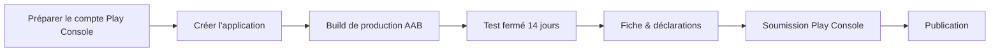

# Publier Élan sur le Google Play Store

Guide pas à pas, de zéro à l'app en ligne. Élan utilise le workflow **managed
Expo + EAS** (pas de dossier `android/` committé) : EAS compile, signe et peut
soumettre l'app. Un build **local** (Gradle) reste possible — voir l'alternative
à l'étape 2.



Ce diagramme résume le parcours de publication. Chaque étape est détaillée
ci-dessous.

## 0. Prérequis (une seule fois)

```bash
npm install -g eas-cli      # CLI EAS
eas login                   # se connecter au compte Expo (owner : wifsimster)
eas whoami                  # vérifier la connexion
```

- Compte **Google Play Console** créé (frais uniques de 25 $).
  - Type **Particulier** suffisant (pas de D-U-N-S nécessaire, même pour pub /
    achats intégrés). Choisir **Organisation** seulement pour afficher
    « BATTISTELLA » comme éditeur (→ D-U-N-S requis, délai ~30 j).
- Vérification d'identité Play Console terminée.

## 1. Créer l'application dans la Play Console

1. Play Console → **Créer une application**.
2. Nom : **Élan** · langue par défaut : **français (France)**.
3. Type : **Application** · gratuite (ou payante, mais ce choix est définitif).
4. Le **nom de package** sera `ovh.battistella.elan` (déjà figé dans `app.json`).
   ⚠️ Irréversible une fois la première version envoyée.

## 2. Premier build de production (AAB)

```bash
eas build --platform android --profile production
```

- Au premier build, EAS propose de **générer la clé de signature** (« Generate
  new keystore »). Accepter → EAS conserve la *upload key*. **Irréversible** :
  EAS gère ensuite la signature pour toi.
- À la fin, EAS fournit un lien vers l'artefact **`.aab`** (App Bundle, requis
  par le Play Store). Le télécharger.
- Vérifier dans les logs : `targetSdkVersion 35` (exigence Google actuelle).

> Sauvegarder la clé de signature : `eas credentials` → plateforme Android →
> exporter/visualiser. À conserver précieusement (perte = impossible de mettre à
> jour l'app sous le même package).

### Alternative : build local (Gradle, sans EAS)

Le projet sait aussi produire un AAB de prod **en local**, signé avec une *upload
key* que **tu** gères (cohérent avec la philosophie local-first). La signature
release est câblée par le config plugin **`plugins/withReleaseSigning.js`**, qui
réinjecte le `signingConfigs.release` à chaque `expo prebuild` — donc rien à
refaire à la main après un prebuild.

Les credentials ne sont **jamais** dans le repo : ils vivent dans
`~/.gradle/gradle.properties` (hors projet, jamais regénéré par prebuild) :

```properties
ELAN_UPLOAD_STORE_FILE=/chemin/absolu/credentials/elan-upload.jks
ELAN_UPLOAD_KEY_ALIAS=elan-upload
ELAN_UPLOAD_STORE_PASSWORD=…
ELAN_UPLOAD_KEY_PASSWORD=…
```

Générer la keystore une fois (validité ~27 ans) :

```bash
keytool -genkeypair -v -keystore credentials/elan-upload.jks -alias elan-upload \
  -keyalg RSA -keysize 2048 -validity 10000 \
  -dname "CN=Damien Battistella, O=BATTISTELLA EI, C=FR"
```

Puis builder (le profil sans la propriété retombe sur la clé debug) :

```bash
npx expo prebuild -p android --clean          # régénère android/ (le plugin câble la signature)
cd android && ./gradlew :app:bundleRelease     # → app/build/outputs/bundle/release/app-release.aab
./gradlew :app:signingReport | grep -A4 "Variant: release"   # vérifier l'empreinte de la clé
```

> ⚠️ `credentials/` est **gitignoré**. Sauvegarder `credentials/elan-upload.jks`
> + les mots de passe hors du repo (gestionnaire de secrets / S3). Perte de
> l'upload key = reset à demander à Google (Play App Signing détient la vraie
> clé de distribution). Avec un build local, l'upload se fait **manuellement**
> dans la Play Console (pas de `eas submit`).

## 3. Test fermé obligatoire (nouveaux comptes)

Tout **nouveau compte développeur** doit, avant la production :

- recruter **au moins 20 testeurs**,
- les garder **opt-in pendant 14 jours consécutifs** sur une piste de test
  fermée.

Étapes : Play Console → **Test → Test fermé** → créer une version → importer
l'AAB → créer une liste d'e-mails de testeurs → partager le lien d'opt-in.

## 4. Remplir la fiche et les déclarations

- **Fiche Play Store** (Présence sur le Store → Fiche principale) : les textes
  sont versionnés dans `fastlane/metadata/android/<locale>/` (fr-FR, en-US,
  es-ES, hi-IN, pt-BR) — copier/coller titre, description courte, description
  complète.
- **Captures d'écran** : réutiliser `docs/screenshots/`.
- **Feature graphic 1024×500** : prêt → `fastlane/metadata/android/fr-FR/images/featureGraphic.png`
  (logo Élan + palette PULSE, sans canal alpha — conforme à l'exigence Google).
  Régénérable via `scripts/feature-graphic.sh`.
- **Politique de confidentialité** : héberger `PRIVACY.md` à une URL publique
  (ex. `https://pro.battistella.ovh/elan/confidentialite`) et la coller dans
  Politique de confidentialité.
- **Sécurité des données** : suivre `docs/DATA_SAFETY.md`.
- **Classification du contenu** : remplir le questionnaire (app sportive →
  classification « Tout public » attendue).
- **Catégorie** : *Santé et remise en forme*.
- **Coordonnées** : e-mail de contact `battistella@proton.me`.

## 5. Soumission

### Option A — automatique via EAS (recommandée)

`eas.json` est déjà configuré (`submit.production`, piste `internal`, statut
`draft`). Il faut juste la clé de service Google :

1. Play Console → **Configuration → accès à l'API** → créer/lier un **compte de
   service Google Cloud** avec le rôle de publication, puis générer une **clé
   JSON**.
2. Enregistrer le fichier à la racine sous **`google-play-service-account.json`**
   (déjà ignoré par git — ne jamais le committer).
3. Lancer :

```bash
eas submit --platform android --profile production
```

EAS envoie le dernier build sur la piste **interne** en **brouillon**. Ajuster
`track` dans `eas.json` (`internal` → `production`) le jour du déploiement grand
public.

### Option B — manuelle

Importer l'AAB directement dans Play Console (Production → Créer une version).

## 6. Mises à jour suivantes

```bash
npm run release      # bump version + versionCode + tag (commit-and-tag-version)
eas build --platform android --profile production
eas submit --platform android --profile production
```

`versionCode` est auto-incrémenté (script `app-json-updater.cjs` +
`autoIncrement` du profil `production`). Le **package** et la **clé de
signature** ne doivent jamais changer.

Pousser le tag (`git push --follow-tags`) déclenche en plus le workflow **APK
Android**, qui attache l'APK de sideload à la Release GitHub — voir
[APK téléchargeable depuis GitHub](#apk-téléchargeable-depuis-github).

## APK téléchargeable depuis GitHub

En parallèle du Play Store, chaque version taguée publie un **APK universel** en
pièce jointe de la Release GitHub, installable en sideload sans compte ni store.
Tout est fait par le workflow [`.github/workflows/android-apk.yml`](../.github/workflows/android-apk.yml)
(« APK Android ») : `npm ci` → `expo prebuild -p android` → `./gradlew :app:assembleRelease`,
entièrement sur le runner GitHub (pas d'EAS, pas de secret obligatoire).

### Déclenchement

| Déclencheur | Effet |
|-------------|-------|
| Push d'un tag `v*` (créé par `npm run release && git push --follow-tags`) | Build, puis création de la Release `vX.Y.Z` si absente et ajout de l'APK `elan-X.Y.Z.apk` |
| **Run workflow** manuel (onglet Actions) sans entrée | Build seul → APK en *artefact* de l'exécution (30 j, réservé aux personnes ayant accès au dépôt) |
| **Run workflow** manuel avec `release_tag` | Build, puis ajout/remplacement de l'APK sur la release de ce tag |

Les notes de release reprennent la section du `CHANGELOG.md` correspondant à la
version, plus le **sha256** de l'APK.

### Signature

Le workflow réutilise `plugins/withReleaseSigning.js` :

- **Sans secret** (par défaut) : `assembleRelease` retombe sur la **clé debug
  publique** d'Android. L'APK s'installe, mais n'importe qui peut en produire un
  autre accepté comme « mise à jour » par Android — d'où l'empreinte sha256
  publiée dans les notes, et l'avertissement affiché dans les logs du workflow.
- **Avec secrets** : l'APK est signé avec ta clé d'upload. Renseigner dans
  *Settings → Secrets and variables → Actions* :

  | Secret | Contenu |
  |--------|---------|
  | `ANDROID_KEYSTORE_BASE64` | `base64 -w0 credentials/elan-upload.jks` |
  | `ANDROID_KEYSTORE_PASSWORD` | mot de passe du keystore |
  | `ANDROID_KEY_ALIAS` | `elan-upload` |
  | `ANDROID_KEY_PASSWORD` | mot de passe de la clé |

> ⚠️ Un APK signé localement (clé debug **ou** clé d'upload) n'a pas la signature
> de **Play App Signing**. Une installation venant du Play Store et un APK GitHub
> ne peuvent donc pas se mettre à jour l'un l'autre : désinstaller l'un avant
> d'installer l'autre. La base SQLite locale est perdue à la désinstallation —
> penser à la sauvegarde S3 (`docs/SAUVEGARDE.md`) ou à l'export avant.

## Aide-mémoire commandes

```bash
eas build --platform android --profile production   # AAB de prod
eas submit --platform android --profile production  # envoi Play Console
eas credentials                                     # voir/gérer la signature
eas build:list                                      # historique des builds
```
