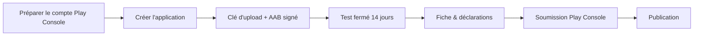
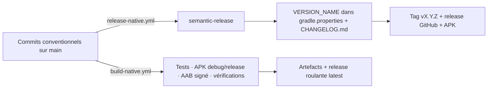

# Publier Élan sur le Google Play Store

Guide pas à pas, de zéro à l'app en ligne, pour l'application native
(Kotlin / Jetpack Compose, projet Gradle à la racine du dépôt). Tout se
construit **en local ou sur GitHub Actions** : pas de service de build tiers.



## 0. Prérequis (une seule fois)

- **JDK 17** (Temurin) et le **SDK Android** (platform 36, build-tools pour
  `dexdump`/`apksigner`) ; `readelf` (binutils) et `unzip` pour les scripts de
  vérification ; `java` pour `bundletool`.
- Compte **Google Play Console** créé (frais uniques de 25 $).
  - Type **Particulier** suffisant. Choisir **Organisation** seulement pour
    afficher « BATTISTELLA » comme éditeur (→ D-U-N-S requis, délai ~30 j).
- Vérification d'identité Play Console terminée.

Vérifier que tout compile et que les tests passent :

```bash
./gradlew testDebugUnitTest assembleDebug
```

## 1. Créer l'application dans la Play Console

1. Play Console → **Créer une application**.
2. Nom : **Élan** · langue par défaut : **français (France)**.
3. Type : **Application** · gratuite (ou payante, mais ce choix est définitif).
4. Le **nom de package** est `ovh.battistella.elan` (`applicationId` dans
   `app/build.gradle.kts`). ⚠️ Irréversible une fois la première version
   envoyée — et c'est celui d'Élan 1.x, ce qui permet la mise à jour en place.
5. S'inscrire à **Play App Signing** : Google détient la clé de distribution,
   vous ne gérez que la **clé d'upload** ci-dessous.

## 2. Clé d'upload et signature

### Générer la clé (une fois, en local)

```bash
./scripts/setup-upload-keystore.sh          # → elan-upload.jks (alias elan-upload)
```

Le script lance `keytool`, demande un mot de passe de keystore et un mot de
passe de clé (à ranger dans un gestionnaire de mots de passe), puis imprime le
bloc `keystore.properties` et les commandes `gh secret set` pour la CI.
`*.jks` et `keystore.properties` sont **gitignorés** : ne jamais les committer,
les sauvegarder hors du dépôt.

### Signature locale

Copier `keystore.properties.example` en `keystore.properties` à la racine :

```properties
storeFile=/chemin/absolu/elan-upload.jks
storePassword=…
keyAlias=elan-upload
keyPassword=…
```

`app/build.gradle.kts` lit ce fichier, ou à défaut les variables
d'environnement **`KEYSTORE_FILE` / `KEYSTORE_PASSWORD` / `KEY_ALIAS` /
`KEY_PASSWORD`**, et signe le build `release` avec la clé d'upload. Sans l'un
ni l'autre, il **retombe sur la clé debug** : l'APK reste installable
(sideload), mais l'AAB n'est **pas** acceptable par le Play Store.

```bash
./gradlew bundleRelease     # → app/build/outputs/bundle/release/app-release.aab (Play Store)
./gradlew assembleRelease   # → app/build/outputs/apk/release/app-release.apk (sideload)
$ANDROID_HOME/build-tools/<ver>/apksigner verify --print-certs app/build/outputs/apk/release/app-release.apk
```

Le certificat doit être celui de la clé d'upload, pas `CN=Android Debug`.

### Secrets CI (GitHub Actions)

Quatre secrets du dépôt (Settings → Secrets and variables → Actions), imprimés
par le script :

| Secret | Valeur |
|--------|--------|
| `KEYSTORE_BASE64` | `base64 -w0 elan-upload.jks` (une seule ligne) |
| `KEYSTORE_PASSWORD` | mot de passe du keystore |
| `KEY_ALIAS` | `elan-upload` |
| `KEY_PASSWORD` | mot de passe de la clé |

Le workflow [`build-native.yml`](../.github/workflows/build-native.yml), étape
« Build release AAB » : si `KEYSTORE_BASE64` existe, il le décode en
`elan-upload.jks`, exporte `KEYSTORE_FILE` et les trois autres variables, puis
lance `bundleRelease` ; sinon l'AAB est signé debug (inspection seulement) et
le journal l'indique.

## 3. Flux de release



- **Version** : `VERSION_NAME` dans `gradle.properties` est la seule source ;
  `versionCode` en dérive (`major * 1_000_000 + minor * 1_000 + patch`, donc
  `2.0.0 → 2000000`, toujours croissant). Ne jamais l'éditer à la main :
  `scripts/set-version.sh <version>` l'écrit, et c'est semantic-release qui
  l'appelle.
- **[`release-native.yml`](../.github/workflows/release-native.yml)** : à chaque
  push sur `main`, semantic-release analyse les commits conventionnels
  (`.releaserc.json`, sections françaises du changelog), calcule la version,
  met à jour `gradle.properties` et `CHANGELOG.md` (commit
  `chore(release): vX.Y.Z [skip ci]`), construit `assembleRelease`, crée le tag
  et la release GitHub avec `elan-X.Y.Z.apk` et `SHA256SUMS.txt`.
- **[`build-native.yml`](../.github/workflows/build-native.yml)** : à chaque
  push et PR, tests JVM d'abord, puis APK debug, APK release, AAB (signé si
  secrets), et trois vérifications bloquantes (voir §4). Sur `main`, publie
  aussi la release roulante `latest` (`elan-release.apk`, `elan-debug.apk`,
  signés debug pour le sideload).
- **Envoi au Play Store** : télécharger l'artefact `elan-release-aab` du run
  correspondant au tag (ou `./gradlew bundleRelease` en local avec la clé
  d'upload), puis Play Console → Production (ou Test) → **Créer une version** →
  importer l'AAB. Pas de publication automatique.

> ⚠️ Un APK GitHub (clé debug ou clé d'upload) n'a pas la signature de **Play
> App Signing** : une installation Play Store et un APK GitHub ne se mettent pas
> à jour l'un l'autre, il faut désinstaller l'un avant d'installer l'autre.
> Penser à la sauvegarde S3 (`docs/SAUVEGARDE.md`) avant.

## 4. Vérifications avant envoi

Les trois scripts tournent en CI sur chaque build et peuvent être lancés
localement sur n'importe quel `.aab`/`.apk` :

| Vérification | Script | Ce qu'il fait |
|--------------|--------|---------------|
| **16 Ko** (exigé par Play pour Android 15+) | `scripts/check-16kb-alignment.sh app-release.aab` | `readelf` sur chaque `.so` embarqué (MapLibre) : tout segment `PT_LOAD` doit être aligné sur 16384 |
| **Bord à bord** (avertissement Play « deprecated edge-to-edge APIs ») | `scripts/check-deprecated-edge-to-edge.sh app-release.apk` | `dexdump` du dex final : aucun appel à `Window.setStatusBarColor` / `setNavigationBarColor` / `setNavigationBarDividerColor` |
| **Taille** | `scripts/check-bundle-size.sh app-release.aab 15` | `bundletool get-size` par ABI : le téléchargement `arm64-v8a` doit rester sous 15 Mo |

À cela s'ajoute un **test sur appareil** du build release (R8 minifié) : une
sortie GPS complète, une séance muscu, une sauvegarde S3, avant chaque
soumission.

## 5. Test fermé obligatoire (nouveaux comptes)

Tout **nouveau compte développeur** doit, avant la production, recruter des
testeurs et les garder opt-in **14 jours consécutifs** sur une piste de test
fermée (vérifier le nombre minimal en vigueur dans la Console).

Étapes : Play Console → **Test → Test fermé** → créer une version → importer
l'AAB → créer une liste d'e-mails de testeurs → partager le lien d'opt-in.

## 6. Fiche et déclarations

- **Fiche Play Store** (Présence sur le Store → Fiche principale) : les textes
  sont versionnés dans `fastlane/metadata/android/<locale>/` (fr-FR, en-US,
  es-ES, hi-IN, pt-BR) — copier/coller titre, description courte, description
  complète. L'application elle-même n'est localisée qu'en français
  (`res/values/`).
- **Captures d'écran** : `docs/screenshots/`.
- **Feature graphic 1024×500** : `fastlane/metadata/android/fr-FR/images/featureGraphic.png`
  (sans canal alpha), régénérable via `node scripts/feature-graphic.mjs` (Playwright).
- **Politique de confidentialité** : héberger `PRIVACY.md` à une URL publique et
  la coller dans Politique de confidentialité.
- **Sécurité des données** : suivre `docs/DATA_SAFETY.md` (permissions,
  flux, types de données).
- **Service de premier plan** : déclarer le type **`location`**
  (`tracking/TrackingService.kt`, `android:foregroundServiceType="location"`) :
  « enregistrement du tracé GPS d'une sortie sportive démarrée par
  l'utilisateur, écran éteint compris ; s'arrête avec la séance ». Joindre une
  courte vidéo de l'écran Sortie si la Console la demande.
- **Health Connect** : déclaration dédiée (Contenu de l'application → Health
  Connect) : écriture seule des types session d'exercice, distance, calories
  actives, fréquence cardiaque ; justification affichée dans l'app
  (`HealthRationaleScreen`). Play exige que l'usage soit décrit dans la
  politique de confidentialité.
- **Classification du contenu** : questionnaire (app sportive →
  « Tout public » attendu).
- **Catégorie** : *Santé et remise en forme*. **Publicité** : non.
  **Accès à l'app** : pas de connexion, accès complet.
- **Coordonnées** : e-mail de contact `battistella@proton.me`.

## 7. Mises à jour suivantes

1. Fusionner des commits conventionnels sur `main` (`feat:`, `fix:`, `perf:`…).
2. Laisser `release-native.yml` créer le tag, la release et le changelog.
3. Récupérer l'AAB signé du run `build-native.yml` de ce commit, l'envoyer dans
   la Play Console, relire la section du `CHANGELOG.md` pour les notes de
   version.

Le **package** et la **clé d'upload** ne doivent jamais changer ; `versionCode`
croît mécaniquement avec le semver.

## Aide-mémoire commandes

```bash
./gradlew testDebugUnitTest assembleDebug        # tests + APK debug
./gradlew assembleRelease                        # APK release (sideload)
./gradlew bundleRelease                          # AAB (Play Store, clé d'upload requise)
./scripts/check-16kb-alignment.sh app/build/outputs/bundle/release/app-release.aab
./scripts/check-deprecated-edge-to-edge.sh app/build/outputs/apk/release/app-release.apk
./scripts/check-bundle-size.sh app/build/outputs/bundle/release/app-release.aab 15
./scripts/setup-upload-keystore.sh               # clé d'upload (une fois)
bash scripts/set-version.sh 2.1.0                # écrit VERSION_NAME (réservé à semantic-release)
```
