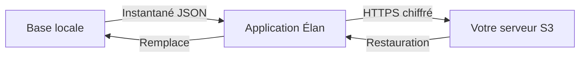

# Sauvegarde de vos données (S3)

Ce document explique la **sauvegarde optionnelle** d'Élan vers votre propre
serveur de stockage. Il s'adresse à l'utilisateur qui souhaite conserver une
copie de ses données hors du téléphone.

## En bref

- La sauvegarde est **désactivée par défaut** et **facultative**.
- Elle envoie vos données vers **votre propre serveur** compatible S3, jamais
  vers l'éditeur.
- Aucun identifiant n'est inclus dans la sauvegarde : ils restent sur l'appareil.
- En transit, les données sont chiffrées (HTTPS).

> **Pourquoi ?** Élan stocke tout en local. Si vous changez de téléphone ou
> perdez l'appareil, vos séances disparaissent. La sauvegarde vous permet de
> garder une copie que **vous** contrôlez.

## Comment ça marche

À chaque sauvegarde, l'application sérialise toute la base en un **seul fichier
JSON** et l'envoie sur votre serveur. Le fichier est **écrasé** à chaque fois :
il n'y a qu'une seule copie, toujours la plus récente.

## Serveurs compatibles

Tout stockage parlant le protocole **S3** convient, notamment les solutions
auto-hébergées :

| Serveur | Usage |
|---------|-------|
| MinIO | Stockage S3 auto-hébergé courant |
| SeaweedFS | Stockage distribué léger |
| Amazon S3 | Service cloud d'Amazon (payant) |

## Configuration

Dans **Réglages → Sauvegarde**, renseignez les champs suivants :

| Champ | Description |
|-------|-------------|
| Endpoint | Adresse de votre serveur (ex. `https://s3.exemple.com`) |
| Région | Région S3 (souvent `us-east-1` par défaut) |
| Bucket | Nom du conteneur de stockage |
| Clé d'accès | Identifiant d'accès S3 |
| Clé secrète | Mot de passe d'accès S3 |
| Clé d'objet | Nom du fichier de sauvegarde (ex. `elan-backup.json`) |

Une fois la configuration complète, deux modes existent :

- **Sauvegarde automatique** — Activée par une option, elle se déclenche
  silencieusement après chaque séance. Un échec n'interrompt rien : il est
  consigné et affiché dans les Réglages.
- **Sauvegarde manuelle** — Le bouton « Sauvegarder maintenant » envoie une copie
  immédiate.

## Restaurer une sauvegarde

Le bouton « Restaurer » télécharge la dernière sauvegarde et **remplace** les
données locales par celles du serveur.

> ⚠️ **Action destructive.** La restauration écrase les données actuelles du
> téléphone. À utiliser sur un nouvel appareil ou après une réinstallation.

> **Détail technique.** Le format de sauvegarde porte un numéro de version
> indépendant du schéma de la base. Une sauvegarde issue d'une version **plus
> récente** de l'application est refusée pour éviter toute corruption : mettez
> d'abord l'application à jour.

## Sécurité

- Les **clés d'accès** sont stockées localement et **exclues** du fichier de
  sauvegarde : elles ne quittent jamais l'appareil dans le contenu sauvegardé.
- Le transfert utilise **HTTPS**.
- La signature des requêtes suit le standard **AWS Signature V4**, calculé sur
  l'appareil sans SDK tiers.
