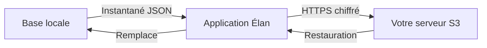

# Sauvegarde de vos données (S3)

Ce document explique la **sauvegarde optionnelle** d'Élan vers votre propre
serveur de stockage. Il s'adresse à l'utilisateur qui souhaite conserver une
copie de ses données hors du téléphone.

## En bref

- La sauvegarde est **désactivée par défaut** et **facultative**.
- Elle envoie vos données vers **votre propre serveur** compatible S3, jamais
  vers l'éditeur.
- Aucun identifiant n'est inclus dans la sauvegarde : ils restent sur l'appareil.
- En transit, les données sont chiffrées (HTTPS obligatoire).
- Le format de fichier (`format: 1`) est **le même qu'en Élan 1.x** : une
  sauvegarde faite avec l'ancienne version se restaure dans la 2.0, et
  inversement.

> **Pourquoi ?** Élan stocke tout en local. Si vous changez de téléphone ou
> perdez l'appareil, vos séances disparaissent. La sauvegarde vous permet de
> garder une copie que **vous** contrôlez.

## Comment ça marche


```mermaid
graph LR
    A[Base locale] -->|Instantané JSON| B[Application Élan]
    B -->|HTTPS chiffré| C[Votre serveur S3]
    C -->|Restauration| B
    B -->|Remplace| A
```

À chaque sauvegarde, l'application sérialise toute la base en un **seul fichier
JSON** et l'envoie sur votre serveur. Le fichier est **écrasé** à chaque fois :
il n'y a qu'une seule copie, toujours la plus récente.

> **Détail technique.** `data/backup/BackupSnapshotCodec.kt` écrit et lit
> l'enveloppe `{format, app, exportedAt, schema, data}` en flux (`JsonWriter` /
> `JsonReader`), donc sans charger les dizaines de milliers de points GPS en
> mémoire ; `data` contient `sessions`, `trackPoints`, `muscuSets`,
> `bodyMeasurements` et `settings`, aux mêmes clés et dans le même ordre que
> l'export de l'app 1.x (`BACKUP_FORMAT = 1`, `BACKUP_APP = "suivi-sport"`,
> `BACKUP_SCHEMA = 7`). L'instantané est produit et rechargé par
> `data/repository/SnapshotRepository.kt` dans une seule transaction Room, en
> conservant les identifiants d'origine. `data/backup/BackupManager.kt`
> orchestre envoi, restauration et statut (`backup_last`).

## Serveurs compatibles

Tout stockage parlant le protocole **S3** convient, notamment les solutions
auto-hébergées :

| Serveur | Usage |
|---------|-------|
| MinIO | Stockage S3 auto-hébergé courant |
| SeaweedFS, Garage | Stockages distribués légers |
| Amazon S3 | Service cloud d'Amazon (payant) |

L'endpoint doit être en **HTTPS** avec un certificat valide (Let's Encrypt par
exemple) ; un préfixe de chemin derrière un reverse proxy
(`https://mon-domaine.tld/s3`) est accepté.

## Configuration

Dans **Réglages → Sauvegarde homelab**, quatre champs suffisent :

| Champ | Description |
|-------|-------------|
| Endpoint | Adresse HTTPS de votre serveur (ex. `https://s3.exemple.com`), accès *path-style* |
| Bucket | Nom du conteneur de stockage |
| Access key | Identifiant d'accès S3 |
| Secret key | Mot de passe d'accès S3 (« Afficher » permet de le relire) |

Sous **Options avancées**, deux champs pré-remplis que vous pouvez laisser tels quels :

| Champ | Défaut |
|-------|--------|
| Région | `us-east-1` (acceptée par MinIO, SeaweedFS, Garage…) |
| Nom de l'objet | `elan-backup.json` |

Les espaces en début et fin de champ sont retirés automatiquement (un espace
collé à une clé secrète produit sinon un `SignatureDoesNotMatch` opaque).

### Remplir par QR code

Taper une clé secrète sur un clavier de téléphone est source d'erreurs. Le
bouton **Scanner un QR code de configuration** lit un QR généré depuis votre
serveur et remplit les champs ; le décodage se fait sur l'appareil, rien n'est
envoyé. Deux formats (`data/backup/BackupQr.kt`) :

- **JSON** (champs partiels acceptés, alias `access_key`/`secret_key`/`url`
  tolérés, casse indifférente) :

  ```json
  {"endpoint":"https://s3.exemple.com","bucket":"elan","accessKeyId":"AK…","secretAccessKey":"SK…"}
  ```

- **URL** compacte (identifiants encodés en URL si besoin) :

  ```
  s3://AK…:SK…@s3.exemple.com/elan
  ```

Génération sur un poste avec `qrencode` (paquet `qrencode`), à afficher dans un
terminal ou en image :

```bash
qrencode -t ANSIUTF8 '{"endpoint":"https://s3.exemple.com","bucket":"elan","accessKeyId":"AK…","secretAccessKey":"SK…"}'
```

> Un QR contient la clé secrète en clair : ne l'affichez qu'au moment de
> scanner, et ne le laissez pas traîner en image.

> **Détail technique.** Le scan utilise le **lecteur de codes de Google Play
> Services** (`ui/components/QrScanButton.kt`, `play-services-code-scanner`) :
> l'interface de capture appartient au système, l'application ne déclare
> **aucune permission caméra** et ne reçoit que le texte du code. Sans Play
> Services, le bouton disparaît et la saisie manuelle reste possible.

Une fois la configuration complète, deux modes existent :

- **Sauvegarde automatique** — Activée par l'interrupteur, elle se déclenche
  silencieusement après chaque séance enregistrée (ou retypée). Un échec
  n'interrompt rien : il est consigné et affiché dans les Réglages
  (« Échec le … »).
- **Sauvegarde manuelle** — Le bouton « Sauvegarder maintenant » envoie une copie
  immédiate.

> **Détail technique.** La sauvegarde automatique est une tâche **WorkManager**
> (`sync/BackupWorker.kt`, planifiée par `sync/BackupScheduler.kt` sous le nom
> unique `auto_backup`) : elle attend une connexion réseau, réessaie avec un
> délai exponentiel à partir de 30 s, trois tentatives au plus, et survit à la
> fermeture de l'application. Le déclencheur est `tracking/SessionFinalizer.kt`.

## Restaurer une sauvegarde

Le bouton « Restaurer depuis le serveur » télécharge la dernière sauvegarde et
**remplace** les données locales par celles du serveur, après confirmation.

Au **premier lancement**, la fiche de bienvenue propose aussi « J'ai déjà une
sauvegarde — restaurer » : vous renseignez le serveur, la restauration
s'exécute et la sauvegarde automatique est activée vers ce serveur
(`ui/screens/home/OnboardingSheet.kt`).

> ⚠️ **Action destructive.** La restauration écrase les données actuelles du
> téléphone. À utiliser sur un nouvel appareil ou après une réinstallation.

> **Détail technique.** Le format de sauvegarde porte un numéro de version
> indépendant du schéma de la base. Une sauvegarde issue d'une version **plus
> récente** de l'application (`format` ou `schema` supérieur) est refusée pour
> éviter toute corruption : mettez d'abord l'application à jour. Les réglages
> propres à l'appareil (`backup_s3`, `backup_last`, `map_style_url`, dernier
> import, marqueurs de migration) sont **exclus** à l'export comme à l'import
> (`SettingsRepository.Keys.BACKUP_EXCLUDED`).

## Messages d'erreur

Les erreurs S3 et réseau sont traduites en français par
`data/remote/S3Errors.kt`. Les plus courantes :

| Message | Cause probable |
|---------|----------------|
| « Signature refusée : la clé secrète ne correspond pas à l'access key… » | Secret key mal saisie |
| « Access key « … » inconnue du serveur. » | Access key mal saisie ou révoquée |
| « Le bucket « … » n'existe pas sur ce serveur. » | Bucket à créer côté serveur |
| « Accès refusé… » | Droits insuffisants pour cette clé |
| « Horloge du téléphone trop décalée… » | Régler l'heure automatique |
| « Certificat HTTPS refusé par le téléphone. » | Certificat auto-signé ou expiré |
| « Serveur injoignable… » | Endpoint, port ou réseau |
| « Aucune sauvegarde trouvée sur le serveur. » | Restauration avant toute sauvegarde |

## Sécurité

- Les **clés d'accès** ne sont pas dans la base ni dans le fichier de
  sauvegarde : elles sont chiffrées avec une clé AES-256/GCM de l'**Android
  KeyStore** (`data/secrets/KeystoreSecretStore.kt`, alias `elan.secrets.v1`)
  et écrites dans `files/secrets/`. Elles ne quittent jamais l'appareil dans le
  contenu sauvegardé.
- Le transfert utilise **HTTPS** exclusivement (un endpoint `http://` est refusé).
- La signature des requêtes suit le standard **AWS Signature V4**
  (`data/remote/S3Signer.kt`), calculée sur l'appareil sans SDK tiers ; le
  client (`data/remote/S3Client.kt`, OkHttp) ne fait que `PUT` et `GET` sur
  l'objet configuré.
- Après une mise à jour depuis Élan 1.x, les identifiants sont repris
  automatiquement ; si cela échoue, un message dans la carte Sauvegarde invite
  à les ressaisir (voir [MIGRATION-1.x.md](MIGRATION-1.x.md)).
